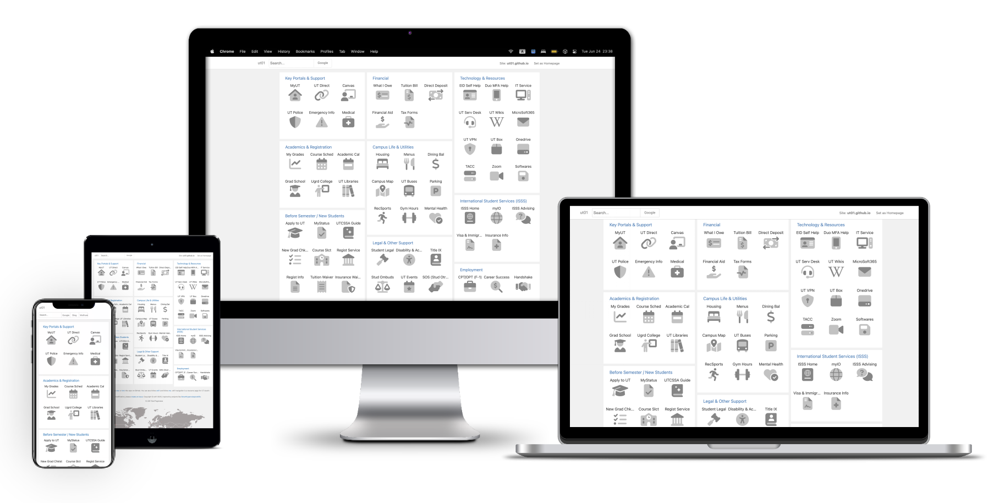

# ut01 - UT Austin Student Navigation Hub!


[](README.md)
[](README.CN.md)
[](https://ut01.github.io/) [](https://github.com/ut01/ut01.github.io) [](https://github.com/ut01/ut01.github.io/fork) [](LICENSE)

> **One-stop navigation for UT Austin students** 🤘  
> Quick access to essential university links without deep navigation

# **Live Site**: [ut01.github.io](https://ut01.github.io/)

---

## What is ut01?

**ut01** is a student-built navigation homepage that consolidates all essential UT Austin links in one place. Created by [Koutian Wu](https://github.com/ktwu01/), a UT Austin PhD student (Class of '24) to solve the frustration of navigating deep university website hierarchies and dealing with frequent login timeouts.




---

## Why ut01 Exists

As a UT student, I was constantly frustrated by:

- **Deep Link Navigation**: Simple tasks like checking dining balance required multiple clicks through complex menus
- **Frequent Logouts**: UT links automatically sign out, making bookmarks redirect to "Sign in with your EID" pages
- **Scattered Resources**: Essential student services spread across dozens of different portals

So I built this centralized hub that organizes everything students actually need.

---

## Key Features

### 🎯 **Essential Categories**
- **Key Portals**: MyUT, UT Direct, Canvas, Emergency Info
- **Academics**: Grades, Course Schedule, Libraries, Registration
- **Financial**: Tuition, Financial Aid, Waivers, Tax Forms
- **Campus Life**: Housing, Dining, Transportation, Recreation
- **Technology**: EID Help, VPN, Microsoft 365, TACC
- **International Services**: ISSS, Visa, Employment Authorization

### 🚀 **Student-Friendly Design**
- **Quick Access**: No deep navigation required
- **Bookmark-Ready**: Set as your browser homepage
- **Always Updated**: Student-maintained for relevance
- **Mobile Responsive**: Works on all devices

---

## How to Use

1. **Visit** [ut01.github.io](https://ut01.github.io/)
2. **Bookmark** frequently used links
3. **Set as Homepage** for instant access
4. **Search** for specific services using the search function

---

## Contributing

Want to add a link or fix something? Contributions are welcome!

### Quick Steps
1. **Fork** this repository
2. **Edit** `index.html` following the template:
   ```html
   <!-- Add new link -->
   
   ```
3. **Submit** a pull request

### Finding Icons
Search for icons at [FontAwesome](https://fontawesome.com/search) and update the `icon` attribute.

---

## Technical Details

- **Framework**: Jekyll with custom templates
- **Hosting**: GitHub Pages
- **License**: MIT (modified from [SmartHypercube/ustclife](https://github.com/SmartHypercube/ustclife))
- **Maintenance**: Student-driven updates

---

## Contact & Support

- **Issues**: [Report problems or suggest additions](https://github.com/ut01/ut01.github.io/issues)
- **Developer**: [Contact maintainer Koutian Wu](https://github.com/ktwu01/)
- **Community**: Built by UT students, for UT students

---

<div align="center">

**🤘 Hook 'em Horns! Made with ❤️ by UT Austin PhD students**

[](https://github.com/ut01/ut01.github.io) [](https://ut01.github.io/)

*Set ut01.github.io as your homepage and never hunt for UT links again!*

</div>