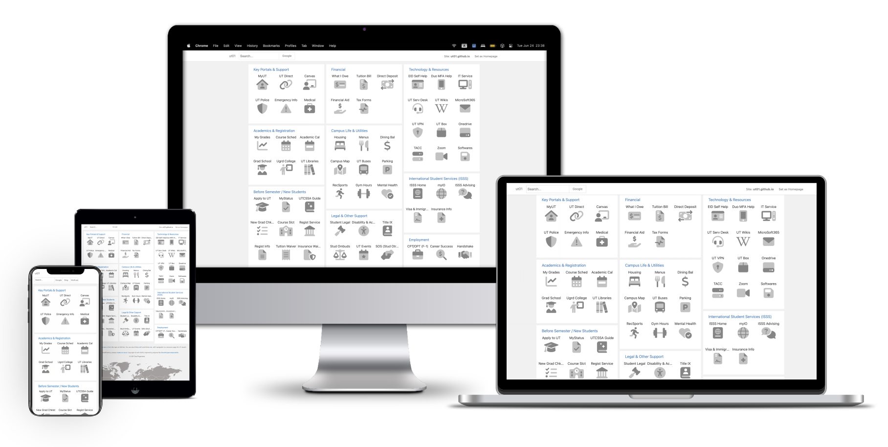
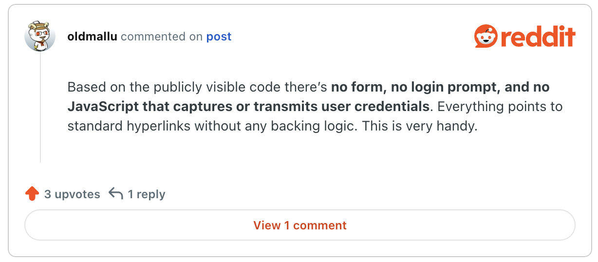

# ut01 - UT Austin Student Navigation Hub!

    

Site Traffic Analytics: 

> **One-stop navigation for UT Austin students** 🤘  
> Quick access to essential university links without deep navigation

# **Live Site**: [ut01.github.io](https://ut01.github.io/)

Click to watch the demo:

---

## feature/news
Aug 20: New in ut01: Registration Guide 🎉
No more searching around for scattered links—everything you need is now in one place!
👉 https://ut01.github.io/guides/registration-guide.html

Aug 18: add "UT AI" section!

---

## What is ut01?

**ut01** is a student-built navigation homepage that consolidates all essential UT Austin links in one place. Created by [Koutian Wu](https://github.com/ktwu01/), a UT Austin PhD student (Class of '24) to solve the frustration of navigating deep university website hierarchies and dealing with frequent login timeouts.

---
## Disclaimer

**Important Notice**: The information and links provided on this site are for convenience only and are not necessarily official or endorsed by The University of Texas at Austin. Even official university information may contain errors or become outdated. Users are responsible for verifying the accuracy and current status of all information before making important decisions. Always refer to official university sources for the most current and accurate information.

## Privacy & Data Collection

ut01.github.io prioritizes user privacy while providing analytics insights for site improvement.

**What We Track:**

- Anonymous website analytics (Google Analytics)
- Visitor statistics (Clustrmaps)
- No personal accounts or credentials

**What We Don't Collect:**

- Personal identification information
- Login credentials
- Educational records
- Email addresses or contact information

**Compliance:**

- No FERPA-regulated educational records processed

👉 [View Reddit comments](https://www.reddit.com/r/UTAustin/comments/1loxvxu/comment/n0ri3k4/) on r/UTAustin

## Why ut01 Exists

As a UT student, I was constantly frustrated by:

- **Deep Link Navigation**: Simple tasks like checking dining balance required multiple clicks through complex menus
- **Frequent Logouts**: UT links automatically sign out, making bookmarks redirect to "Sign in with your EID" pages
- **Scattered Resources**: Essential student services spread across dozens of different portals

So I built this centralized hub that organizes everything students actually need.

---

## Key Features

### 🎯 **Essential Categories**
- **Key Portals**: MyUT, UT Direct, Canvas, Emergency Info
- **Academics**: Grades, Course Schedule, Libraries, Registration
- **Financial**: Tuition, Financial Aid, Waivers, Tax Forms
- **Campus Life**: Housing, Dining, Transportation, Recreation
- **Technology**: EID Help, VPN, Microsoft 365, TACC
- **International Services**: ISSS, Visa, Employment Authorization

### 🚀 **Student-Friendly Design**
- **Quick Access**: No deep navigation required
- **Bookmark-Ready**: Set as your browser homepage
- **Always Updated**: Student-maintained for relevance
- **Mobile Responsive**: Works on all devices

---

## How to Use

1. **Visit** [ut01.github.io](https://ut01.github.io/)
2. **Bookmark** frequently used links
3. **Set as Homepage** for instant access
4. **Search** for specific services using the search function

---

## Contributing

Want to add a link or fix something? Read the [bilingual contribution guide](CONTRIBUTING.md) for setup, validation, and review expectations.

1. Fork this repository and create a branch.
2. Add or update a link in the appropriate section of `_data/links.yml`. Use a short title and English/Chinese search keywords; copy an existing icon that renders on the site.
3. Preview the site, check the destination and both search languages, then submit a pull request with the related issue and your checks.

Good first contributions include correcting one broken resource URL, adding a missing Chinese search synonym, or checking a guide against its official sources. To help maintain a category or review updates regularly, introduce your interests and availability in [the collaborator issue (#26)](https://github.com/ut01/ut01.github.io/issues/26). You can contribute through a fork without repository write access.

---

## Technical Details

- **Framework**: Jekyll with custom templates
- **Hosting**: GitHub Pages
- **License**: [CC BY-SA 4.0](LICENSE). This is a fork of [SmartHypercube/ustclife](https://github.com/SmartHypercube/ustclife).
- **Maintenance**: Student-driven updates

---

## Contact & Support

- **Issues**: [Report problems or suggest additions](https://github.com/ut01/ut01.github.io/issues)
- **Developer**: [Contact maintainer Koutian Wu](https://github.com/ktwu01/)
- **Community**: Built by UT students, for UT students

---

**🤘 Hook 'em Horns! Made with ❤️ by UT Austin PhD students**

 

*Set ut01.github.io as your homepage and never hunt for UT links again!*

